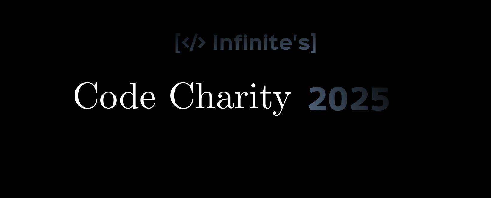

# wrenchlib

A library for creating fast system configuration utilities written in Rust 🦀

## Features

- **Cross-Platform Support**: Works on both Linux and Windows.
- **Package Installation**: Automatically detects the package manager for Linux (e.g., `apt`, `pacman`, `dnf`) and uses `winget` on Windows.
- **Privilege Escalation**: Supports `sudo` and `doas` for Linux, and checks for administrative rights on Windows.
- **System Information Collection**: Helps gather essential system info for automating debloating and other tasks.
- **Flexible API**: Simple and easy-to-use API for developers to integrate into their own tools.

## Usage

### Installing Packages

You can install packages on Linux or Windows using the `install_package` function. It automatically detects the platform and uses the appropriate package manager.

#### Example:

```rust
use wrenchlib::tasks::install::install_package;

fn main() {
    let package_name = "curl";

    match install_package(package_name) {
        Ok(_) => println!("Successfully installed the package!"),
        Err(e) => eprintln!("Failed to install the package: {}", e),
    }
}
```

### Privilege Escalation

The library can handle privilege escalation for system-level tasks like installing packages.

```rust
use wrenchlib::utils::privilege::{detect_privilege_tool, run_as_privileged};

fn main() {
    if let Some(tool) = detect_privilege_tool() {
        println!("Detected privilege tool: {}", tool);
        let result = run_as_privileged("apt", &["install", "-y", "curl"]);
        match result {
            Ok(_) => println!("Package installed successfully."),
            Err(e) => eprintln!("Error: {}", e),
        }
    } else {
        eprintln!("No privilege tool found (e.g., 'sudo' or 'doas').");
    }
}
```

---

## Supported Platforms

- **Linux**: Supports all major Linux distributions with package managers like `apt`, `pacman`, `dnf`, etc.
- **Windows**: Uses `winget` for package management.

---

## Contributing

We welcome contributions to improve this library! If you'd like to contribute, please follow these steps:

1.  Fork the repository.
2.  Create a new branch (`git checkout -b feature-name`).
3.  Make your changes and commit (`git commit -am 'Add new feature'`).
4.  Push to your branch (`git push origin feature-name`).
5.  Create a new Pull Request.

---

## License

This project is licensed under the MIT License - see the LICENSE file for details.

---

## Additional Notes

- Ensure that the appropriate package manager or privilege tool (e.g., `sudo`, `doas`, or `winget`) is installed on the system before using the library.
- On Windows, make sure you have `winget` installed and properly configured.

### Troubleshooting

If you encounter issues with package installation or privilege escalation, ensure the following:

1.  **Linux**: Make sure you have a supported package manager installed (`apt`, `pacman`, etc.).
2.  **Windows**: Ensure `winget` is installed and configured.
3.  **Privilege Tool**: On Linux, ensure `sudo` or `doas` is available for running commands as root.

### Privileged Commands

Some commands in this library require administrative privileges to execute. Ensure you:

- Run the program with `sudo` on Linux for tasks like package installation.
- Use "Run as Administrator" on Windows for elevated commands.
  The library will notify you when elevated privileges are necessary.

### Privilege Escalation

This library supports both `sudo` and `doas` for executing commands with elevated privileges. Ensure that:

- `sudo` is installed and configured correctly, or
- `doas` is installed with the necessary permissions configured in `/etc/doas.conf`.

If neither tool is available, the library can generate a script (`install.sh`) that you can execute manually with root privileges.

---

## Roadmap

Future features planned for this library:

- Enhanced error handling for failed package installations.
- Support for more platforms (e.g., macOS).
- Additional OS automation tools (e.g., service management, debloating utilities).
- Integration with popular configuration management tools like Ansible or Puppet.

## Version & Branches

| Branch      | Version |                  |
| ----------- | ------- | ---------------- |
| Stable      | 0.0.0   | [In Development] |
| Development | 0.1.0   |                  |

---

## Part of Infinite's Code Charity 2025 Event



# Join and Contribute!
